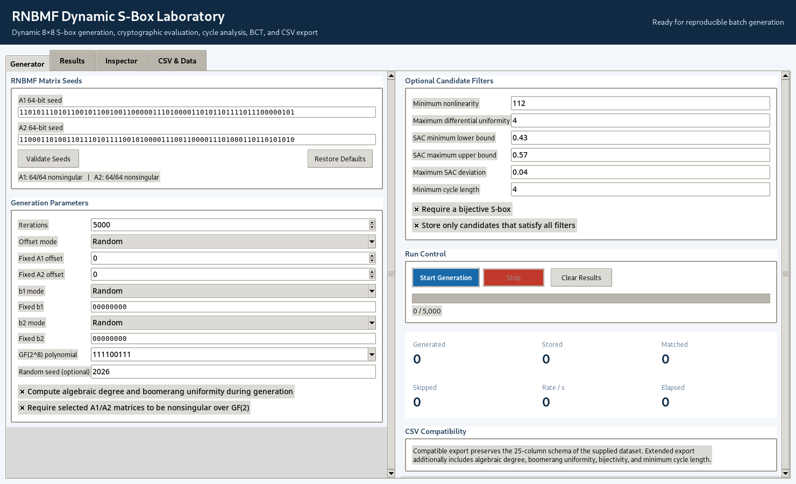
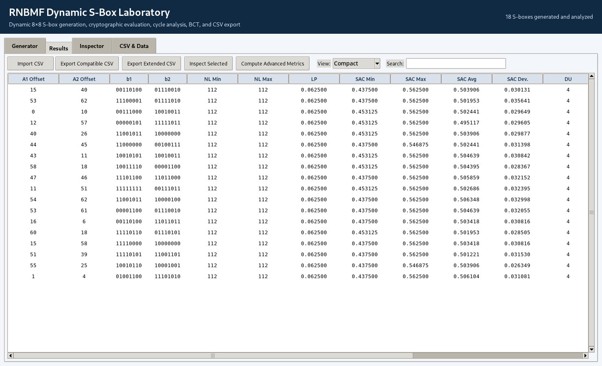
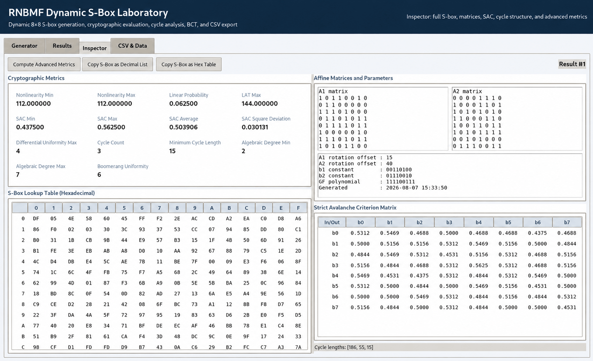
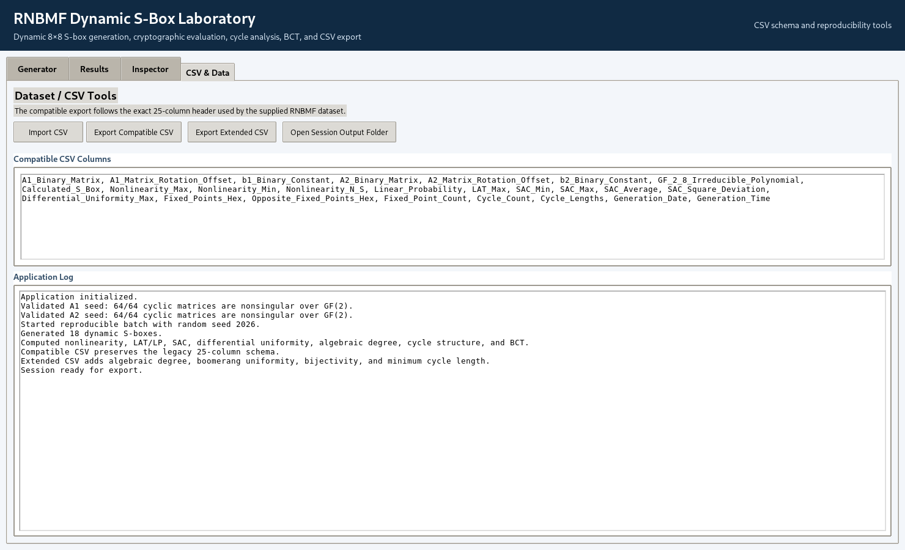

# RNBMF Dynamic S-Box Laboratory

**RNBMF Dynamic S-Box Laboratory** is an English-language desktop application for reproducible generation, inspection, filtering, and cryptographic analysis of dynamic `8×8` substitution boxes constructed from **Rotationally Nonsingular Binary Matrix Families (RNBMFs)**.

The application combines RNBMF seed validation, dynamic affine-parameter selection, finite-field inversion, batch experimentation, S-box-level cryptographic metrics, permutation-cycle analysis, Boomerang Connectivity Table evaluation, and CSV export in one graphical interface.

> **Research scope.** The software evaluates properties of isolated `8×8` S-boxes. Metrics such as differential uniformity, boomerang uniformity, SAC, and cycle structure are S-box-level criteria and do not by themselves establish the security of a complete block cipher.

---

## Screenshots

### 1. Dynamic S-box generator

The **Generator** tab configures the two RNBMF seeds, rotation-offset policy, affine constants, irreducible polynomial, advanced analysis, batch size, and optional candidate filters.



### 2. Batch results and CSV-compatible output

The **Results** tab presents generated S-box instances in a sortable table. Compact, full-compatible, and extended result views are available. Rows can be inspected individually or exported directly to CSV.



### 3. S-box inspector and cryptographic analysis

The **Inspector** tab displays the complete `16×16` hexadecimal lookup table, affine matrices, generation parameters, SAC dependence matrix, permutation-cycle spectrum, algebraic degree, and boomerang uniformity.



### 4. CSV schema and reproducibility tools

The **CSV & Data** tab exposes the compatible dataset schema, import/export controls, output-folder access, and an application log useful for reproducible experiments.



---

## Main capabilities

- Generate dynamic bijective `8×8` S-boxes from two `64-bit` RNBMF seeds.
- Validate all `64` cyclic matrices induced by each seed for nonsingularity over `GF(2)`.
- Select affine matrices through:
  - random rotation offsets;
  - fixed rotation offsets;
  - sequential rotation offsets.
- Use random or fixed `8-bit` affine constants `b1` and `b2`.
- Select and validate a degree-8 irreducible polynomial for `GF(2^8)`.
- Run reproducible batch experiments using an optional random seed.
- Apply optional filters to store only S-boxes satisfying selected criteria.
- Inspect complete S-box lookup tables, matrices, SAC matrices, and permutation cycles.
- Export results using either the original compatible CSV schema or an extended research schema.
- Import previously generated CSV datasets for inspection and further analysis.

---

## S-box construction

The implemented construction is

```text
S(x) = A2( Inv_m( A1*x XOR b1 ) ) XOR b2
```

where:

- `A1, A2 ∈ GL(8,2)` are nonsingular binary `8×8` matrices selected from RNBMFs;
- `b1, b2 ∈ GF(2)^8` are affine constants;
- `Inv_m` is multiplicative inversion in `GF(2^8)` defined by the selected irreducible polynomial `m(x)`, with `0^{-1}=0`.

The software is intended to make each generated instance reconstructible from its stored seeds, matrix offsets, affine constants, and field polynomial.

---

## Implemented cryptographic analysis

The application reports the following S-box-level quantities.

| Category | Metrics / outputs |
|---|---|
| Nonlinearity | Minimum component nonlinearity, maximum component nonlinearity, vectorial compatibility value |
| Linear analysis | LAT maximum and linear approximation probability |
| Differential analysis | Differential uniformity |
| Avalanche behaviour | SAC minimum, maximum, average, deviation, and complete `8×8` SAC matrix |
| Algebraic analysis | Minimum and maximum component algebraic degree |
| Boomerang analysis | Boomerang Connectivity Table based boomerang uniformity |
| Permutation structure | Number of cycles, complete cycle-length spectrum, minimum cycle length |
| Structural checks | Bijectivity and matrix nonsingularity |
| Reproducibility | Seeds, offsets, affine constants, polynomial, generation date/time |

Advanced algebraic-degree and BCT computations can be enabled during generation or computed for a selected result in the Inspector.

---

## Candidate filtering

Batch experiments can optionally filter generated instances according to criteria such as:

- minimum nonlinearity;
- maximum differential uniformity;
- lower bound for SAC minimum;
- upper bound for SAC maximum;
- maximum SAC deviation;
- minimum permutation-cycle length;
- bijectivity;
- nonsingularity of the selected affine matrices.

Enable **Store only candidates that satisfy all filters** when the experiment should retain only accepted instances.

---

## Reproducible batch experiments

For publication-scale experiments, record at least:

1. software version or Git commit;
2. both `64-bit` RNBMF seeds;
3. rotation-offset policy;
4. `b1` and `b2` generation policy;
5. irreducible polynomial;
6. random seed, when random generation is used;
7. number of generated S-boxes;
8. candidate-filter settings;
9. exported CSV results.

A fixed random seed can be entered in the Generator tab to reproduce the same pseudo-random experiment configuration.

For large S-box families, report distributions rather than only individual examples. Depending on the metric, useful summaries include mean, standard deviation, median, minimum, maximum, quantiles, acceptance rates, and frequency of specific cycle structures.

---

## CSV output

### Compatible CSV

**Export Compatible CSV** preserves the supplied legacy `25-column` schema:

```text
A1_Binary_Matrix
A1_Matrix_Rotation_Offset
b1_Binary_Constant
A2_Binary_Matrix
A2_Matrix_Rotation_Offset
b2_Binary_Constant
GF_2_8_Irreducible_Polynomial
Calculated_S_Box
Nonlinearity_Max
Nonlinearity_Min
Nonlinearity_N_S
Linear_Probability
LAT_Max
SAC_Min
SAC_Max
SAC_Average
SAC_Square_Deviation
Differential_Uniformity_Max
Fixed_Points_Hex
Opposite_Fixed_Points_Hex
Fixed_Point_Count
Cycle_Count
Cycle_Lengths
Generation_Date
Generation_Time
```

### Extended CSV

**Export Extended CSV** retains all compatible columns and additionally stores:

```text
Algebraic_Degree_Min
Algebraic_Degree_Max
Boomerang_Uniformity
Is_Bijective
Minimum_Cycle_Length
```

See [`docs/CSV_SCHEMA.md`](docs/CSV_SCHEMA.md) for the detailed schema description.

---

## Requirements

- Python `3.10+`
- NumPy `1.24+`
- Tkinter

Tkinter is included with the standard Python installer on Windows. On some Linux distributions it must be installed separately, for example through the system package manager as `python3-tk`.
 

## Typical workflow

1. Open the **Generator** tab.
2. Enter or restore the two `64-bit` RNBMF seeds.
3. Click **Validate Seeds**.
4. Select the number of iterations and offset mode.
5. Configure `b1`, `b2`, the `GF(2^8)` polynomial, and optional random seed.
6. Enable advanced algebraic-degree/BCT analysis when required.
7. Configure optional filters.
8. Click **Start Generation**.
9. Review generated instances in **Results**.
10. Double-click a row or use **Inspect Selected** to open the full S-box Inspector.
11. Export the experiment using **Compatible CSV** or **Extended CSV**.

---

## Running tests

The repository includes unit tests for the main cryptographic and finite-field routines.

```bash
python -m unittest discover -s tests -v
```

The tests cover representative checks for:

- finite-field polynomial validation;
- RNBMF matrix handling;
- S-box generation;
- nonlinearity;
- LAT / linear probability;
- SAC;
- differential uniformity;
- permutation-cycle analysis;
- algebraic degree;
- boomerang uniformity.

---

## Repository structure

```text
RNBMF-Dynamic-SBox-Laboratory/
├── app.py
├── core.py
├── ui.py
├── requirements.txt
├── run_windows.bat
├── run_linux.sh
├── README.md
├── CHANGELOG.md
├── CONTRIBUTING.md
├── RELEASE_CHECKLIST.md
├── VERSION
├── CITATION.cff.template
├── examples/
│   ├── sample_results.csv
│   └── sample_results_extended.csv
├── outputs/
├── tests/
│   └── test_core.py
├── docs/
│   ├── CSV_SCHEMA.md
│   ├── METHODOLOGY.md
│   └── screenshots/
│       ├── 01-generator.png
│       ├── 02-results.png
│       ├── 03-inspector.png
│       └── 04-csv-data.png
└── .github/
    ├── workflows/
    │   └── tests.yml
    └── ISSUE_TEMPLATE/
```

---

## Methodological notes

The program separates several conceptually different forms of evaluation:

- **spectral/linear properties**, such as nonlinearity and LAT-derived quantities;
- **differential properties**, such as differential uniformity;
- **avalanche behaviour**, represented by the SAC matrix and summary statistics;
- **algebraic properties**, represented by component algebraic degree;
- **boomerang behaviour**, represented by BCT-derived boomerang uniformity;
- **permutation structure**, represented by cycle decomposition and minimum cycle length.

These criteria should be interpreted jointly. A favourable value for one metric does not prove overall cryptographic security, and complete-cipher security additionally depends on the round function, diffusion layer, key schedule, number of rounds, implementation, and attack model.

Additional methodological discussion is provided in [`docs/METHODOLOGY.md`](docs/METHODOLOGY.md).
